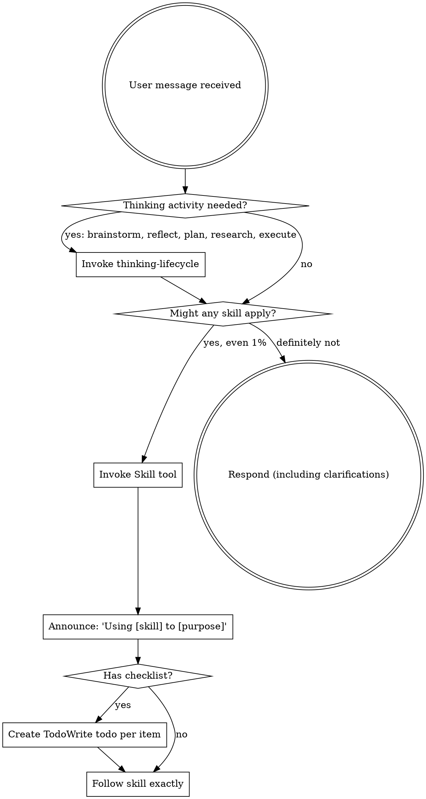

# Using Superpowers

<SUBAGENT-STOP>
If you were dispatched as a subagent to execute a specific task, skip this skill.
</SUBAGENT-STOP>

<EXTREMELY-IMPORTANT>
If you think there is even a 1% chance a skill might apply to what you are doing, you ABSOLUTELY MUST invoke the skill.

IF A SKILL APPLIES TO YOUR TASK, YOU DO NOT HAVE A CHOICE. YOU MUST USE IT.

This is not negotiable. This is not optional. You cannot rationalize your way out of this. </EXTREMELY-IMPORTANT>

## Instruction Priority

Superpowers skills override default system prompt behavior, but **user instructions always take precedence**:

1. **User's explicit instructions** AGENTS.md — highest priority
2. **Superpowers skills** — override default system behavior where they conflict
3. **Default system prompt** — lowest priority

If AGENTS.md says "don't use TDD" and a skill says "always use TDD," follow the user's instructions. The user is in control.

## How to Access Skills

**In Claude Code:** Use the `Skill` tool. When you invoke a skill, its content is loaded and presented to you—follow it directly. Never use the Read tool on skill files.

**In Copilot CLI:** Use the `skill` tool. Skills are auto-discovered from installed plugins. The `skill` tool works the same as Claude Code's `Skill` tool.

**In Gemini CLI:** Skills activate via the `activate_skill` tool. Gemini loads skill metadata at session start and activates the full content on demand.

**In other environments:** Check your platform's documentation for how skills are loaded.

## Platform Adaptation

Skills use Claude Code tool names. Non-CC platforms: see `references/copilot-tools.md` (Copilot CLI), `references/codex-tools.md` (Codex), `references/gemini-tools.md` (Gemini CLI) for tool equivalents. Gemini CLI users get the tool mapping loaded automatically via GEMINI.md.

## Using Skills

## The Rule

**Invoke relevant or requested skills BEFORE any response or action.** Even a 1% chance a skill might apply means that you should invoke the skill to check. If an invoked skill turns out to be wrong for the situation, you don't need to use it.

### Continuous Reassessment

Skill relevance is a **continuous assessment, not a one-time gate at task start.** Re-assess skill relevance whenever you read new file content that reveals domain-specific patterns — library imports, framework conventions, data pipeline patterns, naming conventions, or architectural structures covered by a skill. Opening a file that uses a library, framework, or convention covered by a skill is itself a trigger to invoke that skill, even if the original task description did not mention the domain.

Do not treat an initial "no domain skills apply" decision as final. The initial assessment is based on the task description alone. As you read files, open modules, and gather context during a task, new information may reveal that a skill is relevant. When it does, invoke the skill before continuing — not after you have already acted on incomplete understanding.



## Corrective Feedback Gate

When a user message points out something you missed or did wrong — phrases like "you forgot X", "you didn't do Y", "you missed Z", or any correction of your behaviour — this is an **automatic, non-optional trigger** for invoking `self-reflecting`.

**User-reported errors are corrective feedback.** When a user reports a runtime error, exception, crash, or any failure caused by your changes, that report is corrective feedback — it identifies something you did wrong. The urgency to unblock the user by fixing the error does not exempt you from the lesson-before-fix sequence. The stronger the urge to "just fix it quickly," the more important it is to file the lesson first, because urgency is exactly the force that causes lessons to be skipped.

```plaintext
<HARD-GATE>
STOP — if this turn contains corrective user feedback OR a user-reported error:
  → The FIRST action must be invoking `self-reflecting`, not editing code.
  → Do NOT open, edit, or modify any source file until `self-reflecting`
    has triaged the feedback and any required lesson has been filed
    via `creating-lessons`.
  → "The user is blocked" is not a valid reason to reorder.
  → "Let me fix this first" is the specific thought pattern this gate exists
    to prevent.
  → If you have already started editing code before checking this gate,
    STOP the edit, invoke `self-reflecting`, file any required lesson, then resume.
</HARD-GATE>
```

**Required sequence:** receive correction → invoke `self-reflecting` (which triages: intent change vs. process failure) → if process failure, invoke `creating-lessons` to create the lesson → **then** fix the problem.

**The diagnosis trap applies here.** When `self-reflecting` triage correctly identifies the root cause and determines that a lesson is required, the agent feels the problem is understood and jumps to remediation — skipping `creating-lessons`. Diagnosing a root cause is not a substitute for documenting it. The stronger your understanding of what went wrong, the higher the risk that you will skip lesson creation. If `self-reflecting` has determined that a lesson is required, then before any remediation, verify: _"What is the lesson issue URL I just created?"_ If you cannot answer, invoke `creating-lessons` now. If `self-reflecting` triage determines the issue is an intent change, suggestion, or preference and no lesson is required, do not force lesson creation.

Do not evaluate whether the correction "warrants" invoking `self-reflecting`. Do not fix first and plan to file later. Do not quote the correct sequence and then override it with "pragmatism" or "user expectations" — reading the rule and choosing to violate it is the worst form of non-compliance, not a sign of good judgment. Any corrective user feedback activates this gate — severity is irrelevant. `self-reflecting` performs the triage to determine whether a lesson is required; your job is to invoke it, not to pre-filter.

### Code Review Context

If the corrective feedback arrives as a **PR review comment** (inline code comment, review thread, or PR-level review feedback), the Corrective Feedback Gate still applies — invoke `self-reflecting` first, then use `receiving-reviews` to process the review feedback. The `receiving-reviews` response pattern (read → understand → verify → evaluate → respond → implement) extracts the reviewer's **full intent**, not just the surface action.

**PR review comments are not exempt from the Corrective Feedback Gate.** Invoke `self-reflecting` first (which triages intent change vs. process failure and files any required lesson), then invoke `receiving-reviews` to determine what the reviewer is actually asking for and implement the fix. If `self-reflecting` triage determines the comment is only a suggestion, preference, or intent change rather than a confirmed process failure, no lesson is required — but `self-reflecting` must still run to make that determination.

**Corrective language in a review comment does not skip `self-reflecting`.** Phrases like "you missed X" or "you forgot Y" in a PR review still trigger `self-reflecting` first; after triage and any required lesson, `receiving-reviews` handles the implementation response.

`self-reflecting` is the corrective-feedback gate, not the session-end / yield-control router. After any required corrective-feedback handling is complete, normal task completion still routes through `verifying-work`.

## Task Completion Gate

When your primary task is complete and you are about to yield control to the user, invoke `verifying-work`. This runs the verification gate (evidence before claims) and, if you are finishing, continues into the completion checkpoint (lessons, skill gaps, self-rating, template). For normal session end / yield-control routing, use `verifying-work`, not `self-reflecting`.

```plaintext
<HARD-GATE>
STOP — before writing a final response or yielding control:
  → Invoke `verifying-work` and follow its harness.
  → The harness runs verification gates first, then asks if you are
    finishing or continuing. If finishing, it runs the completion checkpoint.
  → Do NOT write a final summary, completion message, or closing
    response without completing the full exit sequence.
  → "The task is done" is the highest-risk moment for skipping
    post-completion gates, not a valid reason to skip them.
</HARD-GATE>
```

## HARD-GATE Rationalization Warning

When you encounter any `<HARD-GATE>` in any skill and feel completion pressure — the task is almost done, the gate requires expensive work, the user is waiting — apply this principle:

**If your reason for bypassing this gate sounds like responsible engineering, that is the strongest signal that you are rationalizing, not exercising judgment.**

The most dangerous gate bypasses are the ones that sound most responsible. Obvious shortcuts ("I'm skipping this because it's inconvenient") trigger self-correction. Responsible-sounding rationalizations ("I'm being transparent," "I'm being responsive," "I've done significant work," "I'm being pragmatic") suppress the very self-correction mechanisms meant to prevent them. The better the excuse sounds, the more dangerous it is.

Words like "transparent," "honest," "responsive," "pragmatic," or "I've tried hard enough" near a HARD-GATE should trigger heightened suspicion, not reduced scrutiny.

## Red Flags

These thoughts mean STOP—you're rationalizing:

| Thought                                                         | Reality                                                                                                                                                                                                                                                                                                                                                                                                                                                                                                                                                                                                                                                                                                                                                                                                |
| --------------------------------------------------------------- | ------------------------------------------------------------------------------------------------------------------------------------------------------------------------------------------------------------------------------------------------------------------------------------------------------------------------------------------------------------------------------------------------------------------------------------------------------------------------------------------------------------------------------------------------------------------------------------------------------------------------------------------------------------------------------------------------------------------------------------------------------------------------------------------------------ |
| "This is just a simple question"                                | Questions are tasks. Check for skills.                                                                                                                                                                                                                                                                                                                                                                                                                                                                                                                                                                                                                                                                                                                                                                 |
| "I need more context first"                                     | Skill check comes BEFORE clarifying questions.                                                                                                                                                                                                                                                                                                                                                                                                                                                                                                                                                                                                                                                                                                                                                         |
| "Let me explore the codebase first"                             | Skills tell you HOW to explore. Check first.                                                                                                                                                                                                                                                                                                                                                                                                                                                                                                                                                                                                                                                                                                                                                           |
| "I can check git/files quickly"                                 | Files lack conversation context. Check for skills.                                                                                                                                                                                                                                                                                                                                                                                                                                                                                                                                                                                                                                                                                                                                                     |
| "Let me gather information first"                               | Skills tell you HOW to gather information.                                                                                                                                                                                                                                                                                                                                                                                                                                                                                                                                                                                                                                                                                                                                                             |
| "This doesn't need a formal skill"                              | If a skill exists, use it.                                                                                                                                                                                                                                                                                                                                                                                                                                                                                                                                                                                                                                                                                                                                                                             |
| "I remember this skill"                                         | Skills evolve. Read current version.                                                                                                                                                                                                                                                                                                                                                                                                                                                                                                                                                                                                                                                                                                                                                                   |
| "This doesn't count as a task"                                  | Action = task. Check for skills.                                                                                                                                                                                                                                                                                                                                                                                                                                                                                                                                                                                                                                                                                                                                                                       |
| "The skill is overkill"                                         | Simple things become complex. Use it.                                                                                                                                                                                                                                                                                                                                                                                                                                                                                                                                                                                                                                                                                                                                                                  |
| "I'll just do this one thing first"                             | Check BEFORE doing anything.                                                                                                                                                                                                                                                                                                                                                                                                                                                                                                                                                                                                                                                                                                                                                                           |
| "This feels productive"                                         | Undisciplined action wastes time. Skills prevent this.                                                                                                                                                                                                                                                                                                                                                                                                                                                                                                                                                                                                                                                                                                                                                 |
| "I know what that means"                                        | Knowing the concept ≠ using the skill. Invoke it.                                                                                                                                                                                                                                                                                                                                                                                                                                                                                                                                                                                                                                                                                                                                                      |
| "This is a documentation-only task" (skill changes)             | Skills are software. Modifying a skill is NEVER documentation-only — use `modifying-skills`. The only exception is pure cross-reference changes (Related Skills / ToC / URL updates).                                                                                                                                                                                                                                                                                                                                                                                                                                                                                                                                                                                                                  |
| "This environment doesn't support X" / "X isn't available here" | Run `command -v X` or `X --help` **on this specific environment** first. An untested assumption about tool availability is not evidence — only a failed command **executed in the current environment** with an actual error message constitutes evidence. Evidence from other environments (previous runners, other machines, compatibility matrices) does not satisfy this requirement. Each environment must be checked independently regardless of how many similar environments have been tested. A "compatibility matrix" from N other runners does not exempt you from checking THIS runner — statistical inference about environments is not the same as evidence from this environment. The check is cheap; the assumption is expensive. If the command fails silently, report the exit code. |
| "I already checked for skills at the start"                     | Skill relevance is continuous. New file content (imports, patterns, conventions) is a reassessment trigger. Re-invoke.                                                                                                                                                                                                                                                                                                                                                                                                                                                                                                                                                                                                                                                                                 |
| "I'm being transparent about why I can't do this"               | Transparency about a gate bypass is not compliance with the gate. Explaining why you didn't satisfy a HARD-GATE — no matter how honestly — does not satisfy it. Only the gate's required outcome counts.                                                                                                                                                                                                                                                                                                                                                                                                                                                                                                                                                                                               |
| "All tests pass, I'm done"                                      | Verification success is a trigger to invoke `verifying-work`, not permission to yield. Task-completion momentum is strongest when all gates pass.                                                                                                                                                                                                                                                                                                                                                                                                                                                                                                                                                                                                                                                      |

## Skill Priority

When multiple skills could apply, use this order:

1. **Thinking skills first** — load `thinking-lifecycle` to route to the right thinking mode (brainstorming, reflecting, planning, researching, executing)
2. **Implementation skills second** (frontend-design, mcp-builder) - these guide execution
3. **Meta skills** (`creating-skills`, `modifying-skills`, `creating-skill-tests`) - these guide skill creation, editing, and testing. Load `skills-lifecycle` for cross-phase routing between authoring, QA, and testing.

"Let's build X" → `thinking-lifecycle` first (routes to brainstorming), then implementation skills. "Fix this bug" → `debugging-systematically` first, then domain-specific skills.

## Skill Types

**Rigid** (TDD, debugging): Follow exactly. Don't adapt away discipline.

**Flexible** (patterns): Adapt principles to context.

The skill itself tells you which.

## User Instructions

Instructions say WHAT, not HOW. "Add X" or "Fix Y" doesn't mean skip workflows.

## Related Skills

- `verifying-work` — Use before yielding control at end of task. Runs verification gates then completion checkpoint. Single exit gate referenced from AGENTS.md.
- `receiving-reviews` — Use when receiving code review feedback on a PR. Corrective language in a review comment ("you missed", "you forgot") should route here, not just to the Corrective Feedback Gate.
- `creating-skills` — Use when creating new skills or verifying skills work before deployment. Applies TDD discipline to skill authoring.
- `modifying-skills` — Use when editing, updating, or refactoring an existing skill. Same TDD discipline as creation.
- `creating-skill-tests` — Use when applying the RED-GREEN-REFACTOR TDD cycle to test a new or modified skill. Pair with `running-skill-tests` (required) to dispatch runs.
- `writing-skill-test-files` — Use when creating test-\*.md files for a skill — covers file naming, standard header template, required metadata fields, and pre-creation convention verification.
- `running-skill-tests` — Use when dispatching subagent benchmark (RED) or compliance (GREEN) runs. This skill is **mandatory** whenever you execute a test scenario — never self-evaluate.
- `running-skill-tests-batch` — Use when running ALL skill behavioral tests in the repository at once using the batch runner script.
- `auditing-skill-test-coverage` — Use when a task modifies multiple skills and you need to verify test coverage follows the change surface area.
- `debugging-systematically` — Use when encountering any bug, test failure, or unexpected behavior. Requires root cause investigation before proposing fixes.
