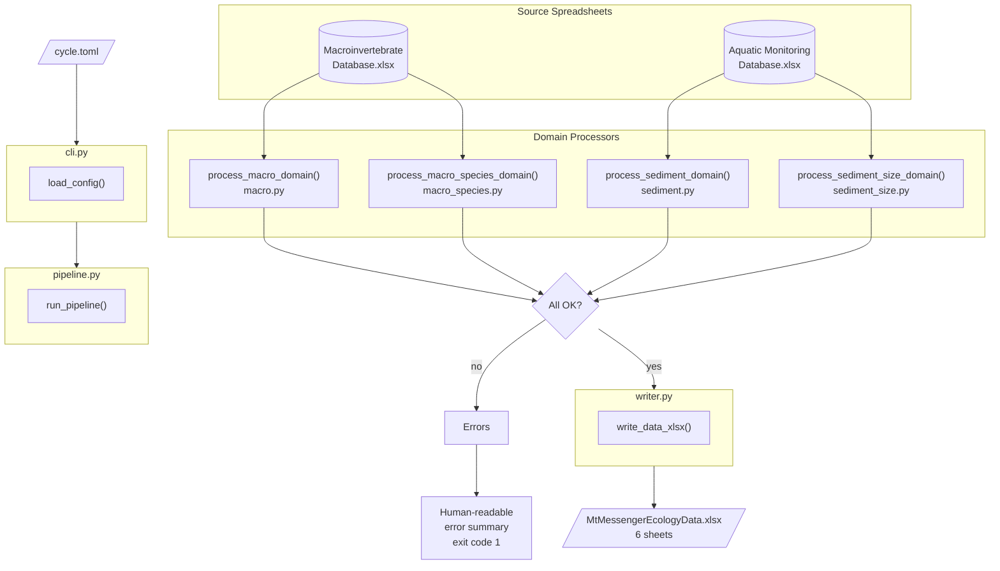

# Mt Messenger Ecology Figure Pipeline

<!-- badges: start -->

[](<https://tonkintaylor.atlassian.net/wiki/home>)

[](<https://github.com/astral-sh/ruff>)
[](<https://tonkintaylor.atlassian.net/jira/projects>)
<!-- badges: end -->

## Introduction

Automated figure generation for regular reporting on Mt Messenger.

Job number: 100181.4600

## Pipeline Architecture



## Running the Pipeline

After setup, three commands are available:

```Powershell
# Process input spreadsheets → MtMessengerEcologyData.xlsx
mgen data

# Generate figures from the data xlsx (runs R pipeline)
mgen figures

# Generate figures from a manually edited copy
mgen figures --data ./my-edited-copy.xlsx

# Run data processing + figures back-to-back
mgen all

# Validate config without running anything
mgen validate
```

All commands accept an optional path to `cycle.toml` (defaults to `./cycle.toml`).

## Getting Started

### One-time setup

Run the following command in Windows PowerShell to install Python, R, all
dependencies, and configure VS Code (your current directory should be the root
of the repo):

```Powershell
./tasks/dev_sync.ps1
```

## Other Development Tasks

### Adding a dependency (or regenerating the requirements files.)

Add a lowercase name of the package to the [project].dependencies section of the
`pyproject.toml` file. You will then need to re-generate the requirements files and
install the package via:

```Powershell
./tasks/dev_sync.ps1
```

### Releasing a package version

Run the following command in Windows Powershell to release a new version of the package:

```Powershell
./tasks/release.ps1
```

The branch will be automatically created and pushed to the cloud, ready for a PR to be
created.

## Adding to changelog

Add a new file at `doc/whatsnew/{issue_num}.{entry_type}.md` where `{issue_num}` is
the JIRA issue number being worked on, and `{entry_type}` is one of `feature`, `bugfix`,
`doc`, `removal`, `newhome`, `test`, or `devconfig`.

In the file provide a description of the change that will appear in the changelog.
