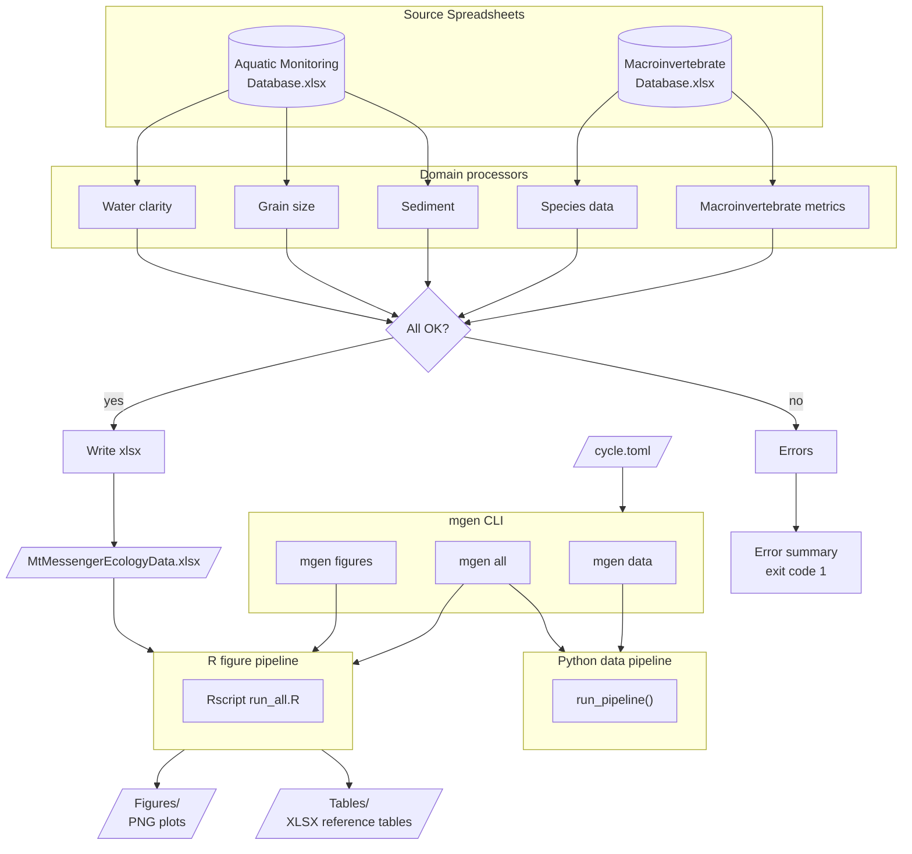

# Mt Messenger Ecology Pipeline

<!-- badges: start -->


[](<https://github.com/astral-sh/ruff>)
<!-- badges: end -->

Automated data processing and figure generation for Mt Messenger aquatic
ecology monitoring reports. Reads the MTMA monitoring databases, produces
a consolidated data spreadsheet, and generates publication-ready figures
and reference tables.

**Job number:** 100181.4600

## Features

- Processes macroinvertebrate and aquatic monitoring databases into a
  single consolidated xlsx with per-domain sheets
- Generates sediment, macroinvertebrate metric, NMDS, and water clarity
  figures as PNG plots
- Exports reference tables (MCI/QMCI scores, NMDS coordinates, species
  scores, community composition)
- Validates input data and reports errors with clear messages
- Configurable input/output paths via `cycle.toml`

## Quick Start

```powershell
# 1. Clone the repo into your working directory
cd R:\BEKA\mt_messenger
git clone https://github.com/tonkintaylor/p-100181.4600-mt-messenger-ecology.git .

# 2. Install Python, R, and the mgen command
./tasks/install.ps1

# 3. Edit cycle.toml with your input/output paths (see Configuration below)

# 4. Run the full pipeline
mgen all
```

## Installation

### Prerequisites

- **Windows** with PowerShell
- **Git** (with Git Bash — included in [Git for Windows])

Python and R are installed automatically by the install script if not
already present.

[Git for Windows]: https://git-scm.com/download/win

### Install steps

Open **PowerShell** and run:

```powershell
cd R:\BEKA\mt_messenger
git clone https://github.com/tonkintaylor/p-100181.4600-mt-messenger-ecology.git .
./tasks/install.ps1
```

This will:

1. Install [uv] (Python package manager) if needed
2. Create a virtual environment and install Python dependencies
3. Install R and required R packages if needed
4. Create `cycle.toml` from the template if it doesn't exist

[uv]: https://docs.astral.sh/uv/

### Activating the environment

After installation, activate the virtual environment in each new terminal
session:

```powershell
.\.venv\Scripts\activate.ps1
```

The `mgen` command is only available when the virtual environment is active.

## Configuration

All paths are configured in `cycle.toml` at the repo root. A template is
created automatically during installation — edit it to match your
reporting cycle.

```toml
[input]
macroinvertebrate_db = "R:/BEKA/mt_messenger/input/MTMA Macroinvertebrate Database.xlsx"
aquatic_monitoring_db = "R:/BEKA/mt_messenger/input/MTMA Aquatic Monitoring Database.xlsx"

[output]
data_xlsx = "R:/BEKA/mt_messenger/output/MtMessengerEcologyData.xlsx"
figures_dir = "R:/BEKA/mt_messenger/output/Figures"
tables_dir = "R:/BEKA/mt_messenger/output/Tables"
```

| Key | Description |
|-----|-------------|
| `macroinvertebrate_db` | Path to the MTMA Macroinvertebrate Database xlsx |
| `aquatic_monitoring_db` | Path to the MTMA Aquatic Monitoring Database xlsx |
| `data_xlsx` | Where to write the consolidated data spreadsheet |
| `figures_dir` | Directory for generated PNG figures |
| `tables_dir` | Directory for generated reference tables (xlsx) |

Use forward slashes (`/`) in paths. Both network (`T:/...`) and local
(`R:/...`) paths are supported.

Validate your config without running the pipeline:

```powershell
mgen validate
```

## Commands

| Command | Description |
|---------|-------------|
| `mgen data` | Process input databases → consolidated xlsx |
| `mgen figures` | Generate R figures and tables from the data xlsx |
| `mgen all` | Run `data` then `figures` back-to-back |
| `mgen validate` | Check config and input paths without writing output |

### `mgen data`

Reads both monitoring databases, processes each domain (macroinvertebrate
metrics, species data, sediment, sediment grain size, water clarity), and
writes a multi-sheet `MtMessengerEcologyData.xlsx`.

```powershell
mgen data
# ✅ Wrote R:\BEKA\mt_messenger\output\MtMessengerEcologyData.xlsx
```

### `mgen figures`

Runs the R plotting pipeline. Reads the data xlsx and produces figures
organised into subdirectories by topic:

```
Figures/
├── Clarity/      # Water clarity boxplots, time series, NTU scatter
├── Macro/        # MCI, QMCI, taxa richness, EPT plots per site
├── NMDS/         # Ordination plots, species overlays
└── Sediment/     # Grain size, embeddedness, fine sediment plots

Tables/
├── Community/    # Composition summaries, indicator species
└── NMDS/         # Site coordinates, species scores, reference taxa
```

```powershell
mgen figures
```

To generate figures from a manually edited copy of the data:

```powershell
mgen figures --data R:\BEKA\mt_messenger\output\MtMessengerEcologyData_edited.xlsx
```

### `mgen all`

Runs both steps in sequence — the most common usage:

```powershell
mgen all
```

### Options

All commands accept:

- An optional path to a different config file: `mgen all path/to/cycle.toml`
- `-q` / `--quiet` to suppress status messages (errors still print)

## Pipeline Architecture



## Troubleshooting

### `mgen` command not found

Activate the virtual environment first:

```powershell
.\.venv\Scripts\activate.ps1
```

### R package installation fails

If `./tasks/install.ps1` fails during R setup, install packages manually
in R:

```r
install.packages(c("readxl", "dplyr", "tidyr", "ggplot2", "vegan",
                    "indicspecies", "ggrepel", "zoo", "patchwork",
                    "openxlsx", "lubridate"))
```

### Input file not found

Check that the paths in `cycle.toml` use forward slashes and that the
files exist. Run `mgen validate` to verify.

## Development

### Full developer setup

Includes linters, test tools, pre-commit hooks, and VS Code configuration:

```powershell
./tasks/dev_sync.ps1
```

### Running tests

```powershell
uv run pytest
```

### Adding a dependency

Add the package to `[project].dependencies` in `pyproject.toml`, then:

```powershell
./tasks/dev_sync.ps1
```

### Releasing a version

```powershell
./tasks/release.ps1
```

## Changelog

Add a new file at `doc/whatsnew/{issue_num}.{entry_type}.md` where
`{entry_type}` is one of `feature`, `bugfix`, `doc`, `removal`,
`newhome`, `test`, or `devconfig`.

## Licence

[Proprietary](LICENSE.txt) — Tonkin & Taylor Limited
