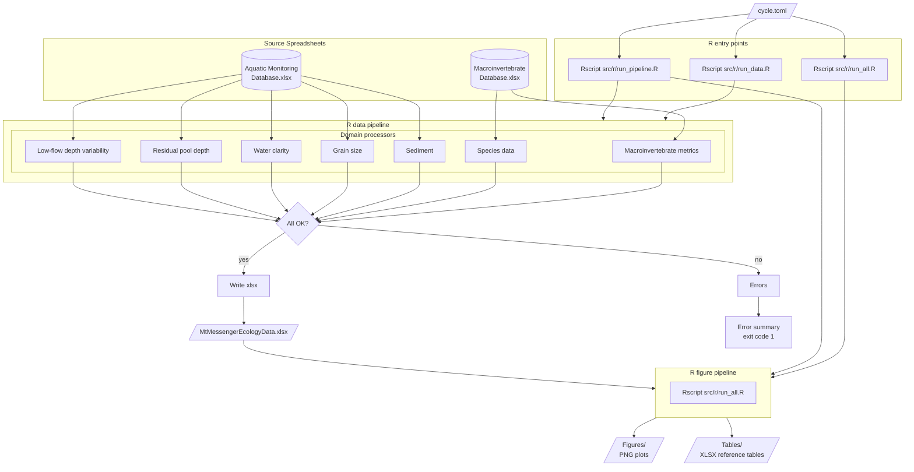

# Mt Messenger Ecology Pipeline

<!-- badges: start -->


<!-- badges: end -->

Automated data processing and figure generation for Mt Messenger aquatic
ecology monitoring reports.

**Job number:** 100181.4600

**For usage instructions see [docs/usage.md](docs/usage.md).**

## Pipeline Architecture



## Getting Started

### Pipeline users

See [docs/usage.md](docs/usage.md) for installation and usage instructions.

### Developers

Full developer setup with linters, test tools, pre-commit hooks, and
VS Code configuration:

```powershell
./tasks/dev_sync.ps1
```

## Development

### Running R code

Use the Rscript entry points for normal operation. All scripts activate
renv explicitly before loading packages.

```powershell
# Data pipeline only
Rscript --vanilla src/r/run_data.R cycle.toml

# With validation (checks paths and config before running)
Rscript --vanilla src/r/run_data.R cycle.toml --validate

# Full pipeline: data + figures + tables
Rscript --vanilla src/r/run_pipeline.R cycle.toml

# Figures and tables only (requires the data xlsx to exist; reads paths from cycle.toml)
Rscript --vanilla src/r/run_all.R
```

For one-off diagnostics that do not need project packages, use `--vanilla`:

```powershell
Rscript --vanilla -e "sessionInfo()"
```

For one-off commands that do need project packages, bootstrap renv explicitly:

```powershell
Rscript --vanilla -e "source('renv/activate.R'); packageVersion('ggplot2')"
```

### Running tests

```powershell
Rscript --vanilla -e "source('renv/activate.R'); library(readxl); library(openxlsx); library(dplyr); library(tidyr); library(lubridate); testthat::test_dir('tests/r')"
```

### Managing R packages

R dependencies are managed by [renv](https://rstudio.github.io/renv/) with
versions locked in `renv.lock`. The `DESCRIPTION` file declares the direct
R package dependencies.

**Adding a package:**

1. In R from the project root: `renv::install("newpackage")`
2. Add the package to the `Imports` field in `DESCRIPTION`
3. Update the lockfile: `renv::snapshot()`
4. Commit both `DESCRIPTION` and `renv.lock`

**Restoring after a pull:**

```powershell
Rscript --vanilla -e "source('renv/activate.R'); renv::restore()"
```

Or just re-run `./tasks/dev_sync.ps1` — it restores R packages automatically.

## Licence

[Proprietary](LICENSE.txt) — Tonkin & Taylor Limited
