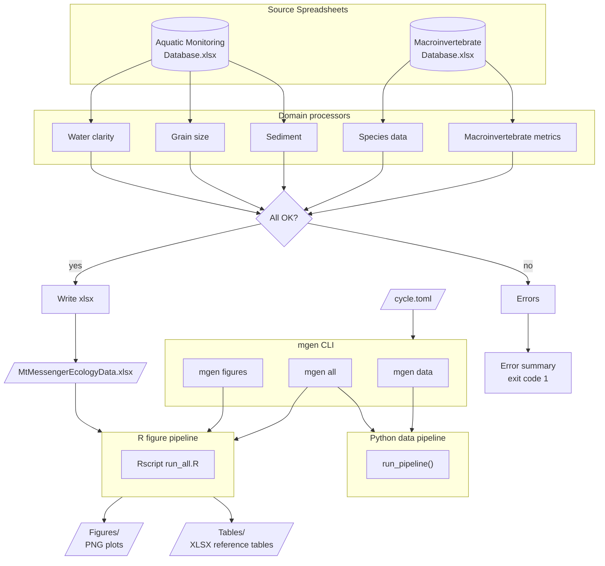

# Mt Messenger Ecology Pipeline

<!-- badges: start -->


[](<https://github.com/astral-sh/ruff>)
<!-- badges: end -->

Automated data processing and figure generation for Mt Messenger aquatic
ecology monitoring reports.

**Job number:** 100181.4600

**For usage instructions see [docs/usage.md](docs/usage.md).**

## Pipeline Architecture



## Getting Started

### Pipeline users

See [docs/usage.md](docs/usage.md) for installation and usage instructions.

### Developers

Full developer setup with linters, test tools, pre-commit hooks, and
VS Code configuration:

```powershell
./tasks/dev_sync.ps1
```

## Development

### Running tests

```powershell
uv run pytest
```

### Adding a dependency

Add the package to `[project].dependencies` in `pyproject.toml`, then:

```powershell
./tasks/dev_sync.ps1
```

### Releasing a version

```powershell
./tasks/release.ps1
```

The branch will be automatically created and pushed, ready for a PR.

### Changelog

Add a new file at `doc/whatsnew/{issue_num}.{entry_type}.md` where
`{entry_type}` is one of `feature`, `bugfix`, `doc`, `removal`,
`newhome`, `test`, or `devconfig`.

## Licence

[Proprietary](LICENSE.txt) — Tonkin & Taylor Limited
