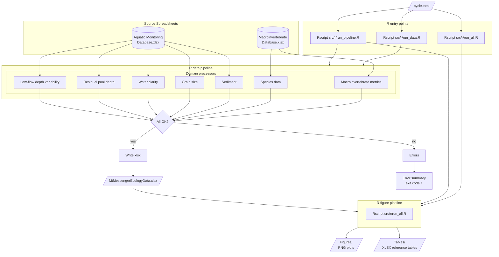

# Mt Messenger Ecology Pipeline

<!-- badges: start -->


<!-- badges: end -->

Automated data processing and figure generation for Mt Messenger aquatic
ecology monitoring reports.

**Job number:** 100181.4600

**For usage instructions see [docs/usage.md](docs/usage.md).**

## Pipeline Architecture



## Getting Started

### Pipeline users

See [docs/usage.md](docs/usage.md) for installation and usage instructions.

### Click-to-run app (Windows)

Non-technical colleagues can run the whole pipeline from a GUI — **no R, no
admin, no setup**. A bundled Windows installer ships its own R and packages.
See [`launcher/README.md`](launcher/README.md) for end-user instructions,
how to rebuild the installer, and how it works.

### Developers

Full developer setup with linters, test tools, pre-commit hooks, and
VS Code configuration:

```powershell
./tasks/dev_sync.ps1
```

## Development

### Running R code

Use the Rscript entry points for normal operation. They run with `--vanilla`
and load packages from the synced project library (see Managing R packages).

```powershell
# Data pipeline only
Rscript --vanilla src/r/run_data.R cycle.toml

# With validation (checks paths and config before running)
Rscript --vanilla src/r/run_data.R cycle.toml --validate

# Full pipeline: data + figures + tables
Rscript --vanilla src/r/run_pipeline.R cycle.toml

# Figures and tables only (requires the data xlsx to exist; reads paths from cycle.toml)
Rscript --vanilla src/r/run_all.R
```

For one-off diagnostics that do not need project packages, use `--vanilla`:

```powershell
Rscript --vanilla -e "sessionInfo()"
```

Project packages live in the default library once synced, so they are available
without any bootstrap:

```powershell
Rscript --vanilla -e "packageVersion('ggplot2')"
```

### Running tests

```powershell
Rscript --vanilla -e "testthat::test_dir('tests/r')"
```

### Managing R packages

R dependencies are pinned by a dated [Posit Package Manager][ppm] snapshot, so
every machine (Windows, macOS, Linux/CI) installs identical package versions
from plain `install.packages()` — no Docker, and no `renv::restore()`.

The `DESCRIPTION` file is the single source of truth:

- `Imports:` — the direct packages to install
- `Config/Repo/Snapshot:` — the snapshot date (`YYYY-MM-DD`) that pins versions
- `Config/R/Version:` — the required R major.minor

[`scripts/sync_r_packages.R`](scripts/sync_r_packages.R) reads those fields,
checks the R version, and installs anything missing or drifted from the
snapshot. The same script is used by local dev and by CI.

**Syncing after a pull:**

```powershell
Rscript scripts/sync_r_packages.R
```

Or just re-run `./tasks/dev_sync.ps1` — it syncs R packages automatically.
Use `--dry-run` to preview, or `--force` to reinstall everything to the snapshot.

**Adding a package:**

1. Add the package to the `Imports:` field in `DESCRIPTION`
2. Run `Rscript scripts/sync_r_packages.R`
3. Commit `DESCRIPTION`

**Bumping versions:** change `Config/Repo/Snapshot:` to a newer date and re-run.

[ppm]: https://packagemanager.posit.co/

## Licence

[Proprietary](LICENSE.txt) — Tonkin & Taylor Limited
