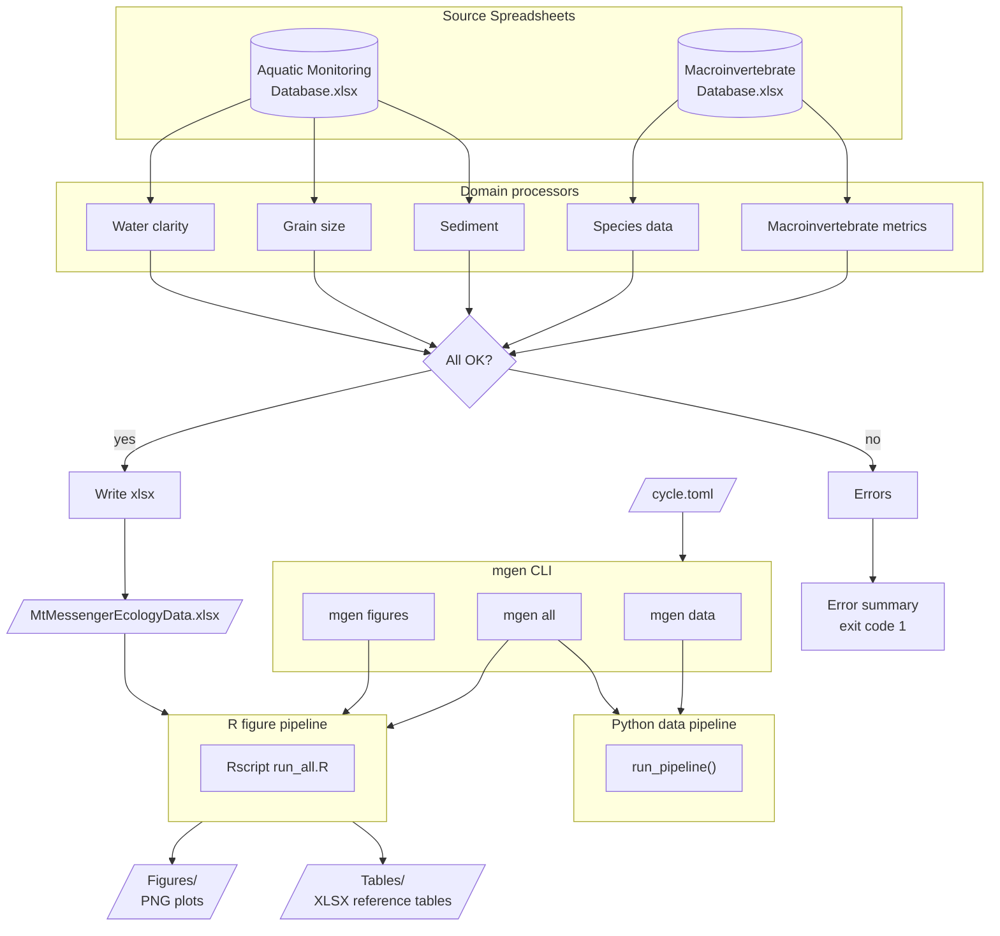

# Mt Messenger Ecology Pipeline

<!-- badges: start -->


[](<https://github.com/astral-sh/ruff>)
<!-- badges: end -->

Automated data processing and figure generation for Mt Messenger aquatic
ecology monitoring reports.

**Job number:** 100181.4600

**For usage instructions see [docs/usage.md](docs/usage.md).**

## Pipeline Architecture



## Getting Started

### Pipeline users

See [docs/usage.md](docs/usage.md) for installation and usage instructions.

### Developers

Full developer setup with linters, test tools, pre-commit hooks, and
VS Code configuration:

```powershell
./tasks/dev_sync.ps1
```

## Development

### Running Python code

Python code is run through uv to ensure the virtual environment is used:

```powershell
uv run python src/scripts/my_script.py
uv run mgen data
```

### Running R code

R scripts can be run directly with Rscript. The `.Rprofile` activates
renv automatically:

```powershell
Rscript src/r/run_all.R
```

### Running tests

```powershell
uv run pytest
```

### Managing Python packages

Python dependencies are managed by [uv](https://docs.astral.sh/uv/) with
versions locked in `uv.lock`.

**Adding a package:**

1. Add the package to `[project].dependencies` in `pyproject.toml`
2. Run `./tasks/dev_sync.ps1` (updates `uv.lock` and installs)

**Restoring after a pull:**

```powershell
./tasks/dev_sync.ps1
```

### Managing R packages

R dependencies are managed by [renv](https://rstudio.github.io/renv/) with
versions locked in `renv.lock`. The `DESCRIPTION` file declares the direct
R package dependencies.

**Adding a package:**

1. In R from the project root: `renv::install("newpackage")`
2. Add the package to the `Imports` field in `DESCRIPTION`
3. Update the lockfile: `renv::snapshot()`
4. Commit both `DESCRIPTION` and `renv.lock`

**Restoring after a pull:**

```r
renv::restore()
```

Or just re-run `./tasks/dev_sync.ps1` — it restores both Python and R
packages automatically.

## Licence

[Proprietary](LICENSE.txt) — Tonkin & Taylor Limited
